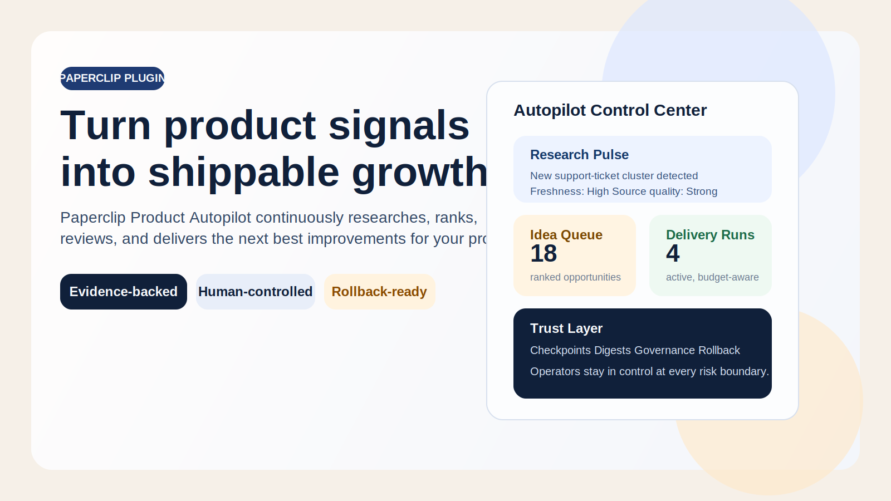
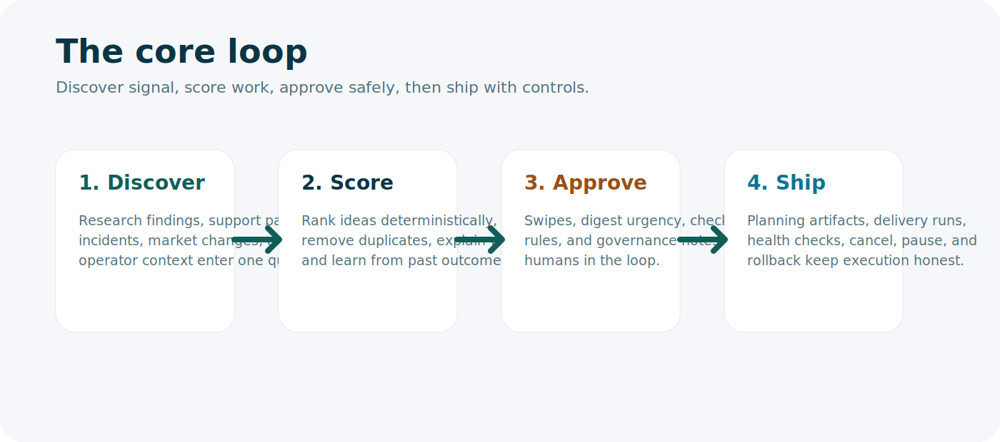
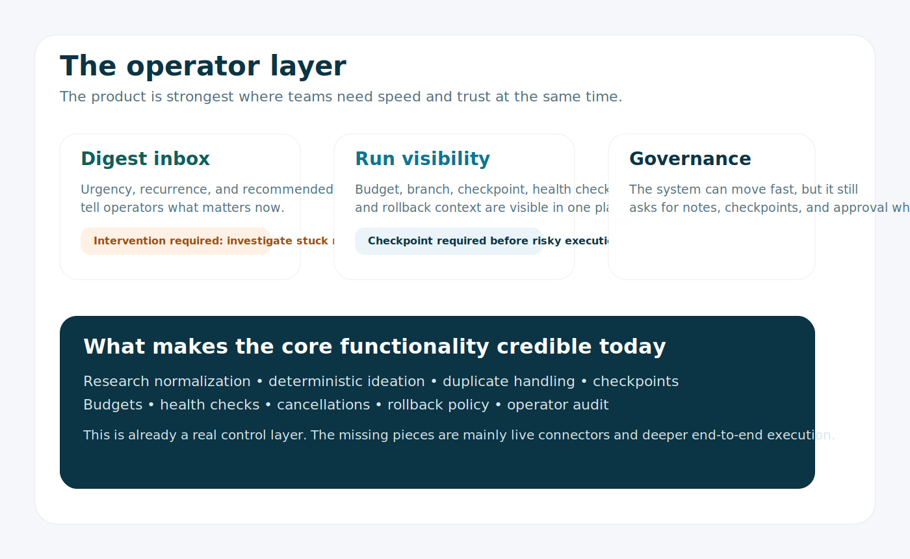

# Paperclip Product Autopilot



Turn scattered product signals into ranked, reviewable, shippable improvements.

Paperclip Product Autopilot is a product operating system for teams that want more output without handing the wheel to a reckless agent. It continuously discovers opportunities, scores them against real evidence, routes them through human review, and executes approved delivery runs with checkpoints, budgets, digests, governance, and rollback.

The core value is not "AI ideas". The core value is a disciplined loop:

- ingest product signal
- rank what matters
- let humans approve risk
- ship through controlled runs

## Why This Exists

Most teams already have enough signal:

- support pain
- incident follow-ups
- product feedback
- market shifts
- roadmap pressure
- operator intuition

What they do not have is a disciplined engine for turning that noise into the next best action.

Product Autopilot closes that gap. It gives founders, product leads, and staff engineers a single system that can:

- discover what matters now
- explain why it matters
- rank what to do next
- learn from operator decisions
- ship work safely inside clear boundaries

## Core Engine

What exists today at the core of the app:

- **A research engine** that captures fresh signals, normalizes provenance, scores source quality, and snapshots research cycles.
- **A ranking engine** that deduplicates ideas, explains scoring, and learns from swipe behavior and delivery outcomes.
- **A decision layer** with digest urgency, recommended actions, governance notes, and checkpoint policies.
- **A delivery system** with planning artifacts, leases, locks, budgets, release-health checks, cancellation, and rollback policy.
- **An operator console** with run visibility, audit timelines, preference signals, budget controls, digest management, and remediation context.



## What Makes It Different

This is not a thin "AI ideas" widget.

It is designed to behave like a disciplined product team member:

- **Evidence before ideation**  
  Ideas are tied to real findings, freshness, source quality, and rationale.

- **Human control at every risk boundary**  
  Checkpoints, governance rules, digests, and operator controls remain in the loop.

- **Learning instead of repetition**  
  The system adapts from swipe feedback, execution outcomes, complexity preferences, and execution-mode history.

- **Operational safety, not autonomy theater**  
  Delivery runs are budget-aware, health-checked, auditable, and rollback-ready.

- **Production-shaped internals**  
  Deterministic tests, runtime validation, CI, repository boundaries, policy services, and explicit state machines.

## Core Flow

1. **Discover**  
   Collect feedback, incidents, market signals, research findings, and operator context.

2. **Score**  
   Normalize, deduplicate, rank, and explain ideas with evidence-backed reasoning.

3. **Approve**  
   Review through swipes, digest urgency, governance notes, and checkpoint policies.

4. **Ship**  
   Run safe delivery flows with budgets, locks, health checks, cancellation, and rollback paths.

## What Is Still Missing

The core is credible, but not finished in the absolute sense. The main missing pieces are:

- **Real signal connectors in production**  
  The internal research model is strong, but the app still needs more live source adapters for support, analytics, incidents, and market inputs.

- **A fully wired execution backend**  
  The delivery model is strong, but the strongest version of the product needs tighter coupling to the real coding and shipping executor used by the team.

- **More live host proof, not just local proof**  
  Packaging, SDK harnesses, worker boot, UI serving, and smoke tests are in place. The next bar is more repeatable validation against a live Paperclip host with actual tool execution.

## Operator-Grade Trust Layer



The plugin is built for teams that care about velocity and control at the same time.

- **Digest urgency and recommended actions** make it obvious what needs attention.
- **Checkpoint policy** makes risky work explicit before runs start.
- **Budget controls** keep automation within operating limits.
- **Audit timelines** make every important run event inspectable.
- **Governance gates** prevent unsafe approval paths.
- **Rollback policy** blocks duplicate or invalid recovery actions.

## Current Product Shape

Today the repo includes:

- research-cycle ingestion with structured provenance
- deterministic ideation and duplicate detection
- preference learning from swipe and outcome signals
- planning artifacts with checkpoint requirements
- delivery lifecycle, cancellation, and health monitoring
- digest cooldown, reopen, escalation, urgency, and recommended actions
- operator UI for ideas, runs, digests, budgets, learning, and audit history

That means the app is already strong at the center of the loop:

- understand signal
- prioritize opportunities
- keep humans in control
- execute inside visible safety constraints

## Install

Install from your Paperclip workspace:

```bash
/plugin install ola-turmo.paperclip-product-autopilot
```

Or install from npm:

```bash
npm install @ola-turmo/paperclip-product-autopilot
```

## Configuration

Configure via `Settings -> Plugins -> Product Autopilot`.

| Setting | Default | Description |
| --- | --- | --- |
| `researchScheduleCron` | `0 9 * * 1` | Weekly research cycle schedule |
| `ideationScheduleCron` | `0 10 * * 1` | Weekly ideation schedule |
| `maybePoolResurfaceDays` | `14` | Days before deferred ideas reappear |
| `maxIdeasPerCycle` | `10` | Idea generation cap per cycle |
| `defaultAutomationTier` | `supervised` | `supervised`, `semiauto`, or `fullauto` |
| `defaultBudgetMinutes` | `120` | Weekly budget per project |
| `autoCreateIssues` | `true` | Create issues for approved ideas |
| `autoCreatePrs` | `false` | Create PRs for supervised-approved runs |

## Registered Tools

```text
list-autopilot-projects   List all projects with Product Autopilot enabled
create-idea               Add a new product idea
get-swipe-queue           Fetch ideas waiting for review
record-swipe-decision     Record pass/maybe/yes/now feedback
start-research-cycle      Trigger a research cycle
generate-ideas            Generate ideas from research and product context
```

## Development

```bash
npm install
npm run typecheck
npm test
npm run build
```

Watch modes:

```bash
npm run dev
npm run dev:ui
```

## Repo Structure

```text
src/
  manifest.ts
  worker.ts
  ui/index.tsx
  services/
  repositories/
  worker/

docs/
  world-class-prd.md
  schema-compatibility-policy.md
```

## Documentation

Start here depending on what you need:

- [End-User Test Guide](./docs/usertest.md)
- [Architecture](./docs/architecture.md)
- [Data Model](./docs/data-model.md)
- [Operator Guide](./docs/operator-guide.md)
- [Contributor Guide](./docs/contributor-guide.md)
- [World-Class PRD](./docs/world-class-prd.md)
- [Final-Mile PRD](./docs/final-mile-prd.md)
- [Signal Ingestion Contract](./docs/signal-ingestion-contract.md)
- [Execution Backend Contract](./docs/execution-backend-contract.md)
- [Live Host Validation](./docs/live-host-validation.md)
- [Kommune UI Review](./docs/kommune-review/report.md)

## Positioning

Paperclip Product Autopilot is for teams that want an always-on product improvement engine without sacrificing reviewability, control, or delivery safety.

If you want a system that can continuously find leverage, explain its choices, and ship inside governance boundaries, this is what the repo is built to become.

## License

MIT
