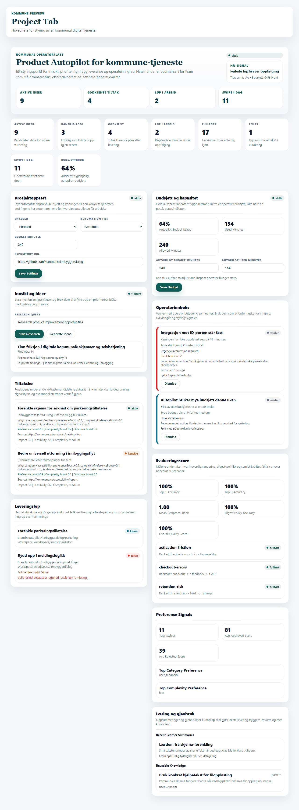
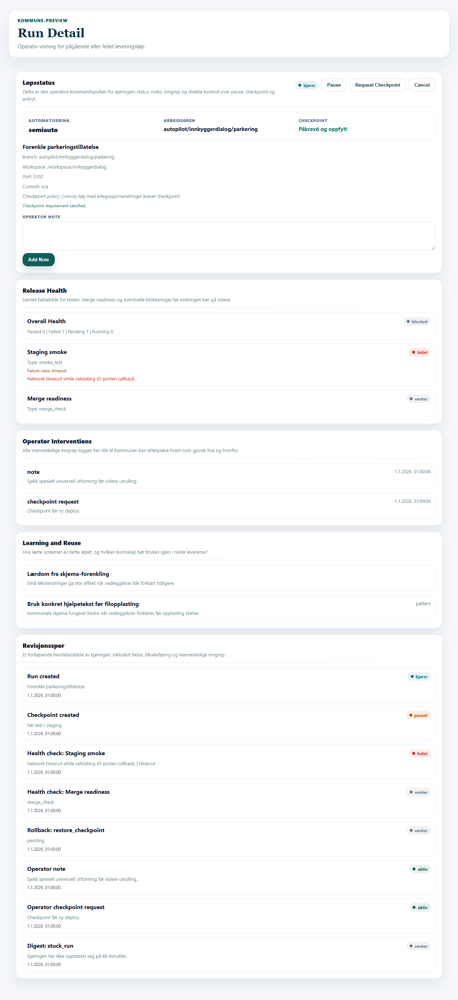
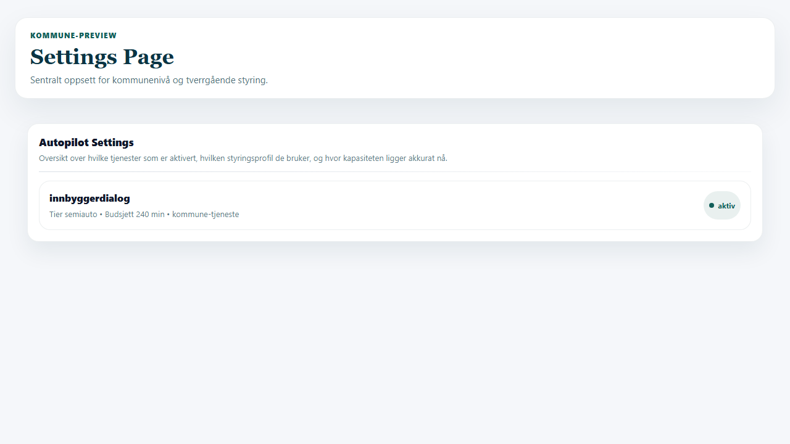
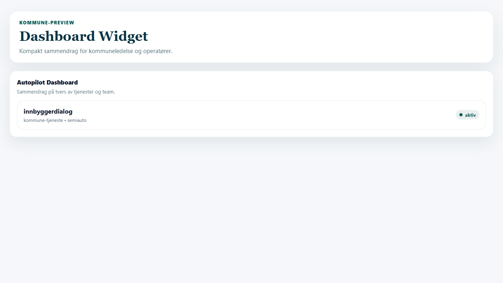
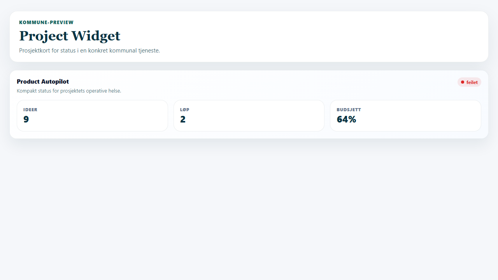
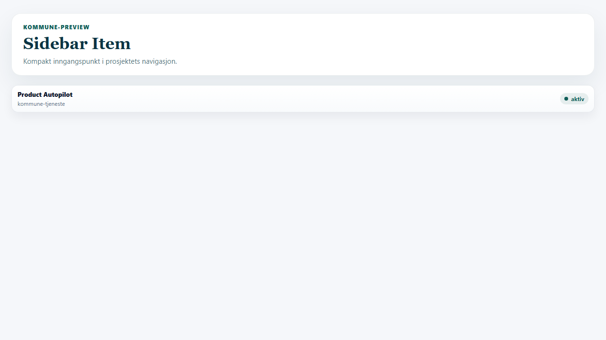

# Kommune UI Review

Denne rapporten dokumenterer en visuell gjennomgang av alle faktiske Product Autopilot-flatene i pluginen, med kommunal brukskontekst som premiss.

Metode:
- bygget en egen preview-harness for alle flater
- tok skjermbilde av hver flate i nettleser
- analyserte hver flate visuelt
- oppdaterte UI-komponentene
- tok nye skjermbilder etter endringer

Designreferanse:
- hovedretningen er nå eksplisitt forankret i [kurs.ing](https://www.kurs.ing)
- paletten følger lys bakgrunn `#F5F7FA`, mørk blå tekst `#0B3444`, grønn accent `#115E59`
- uttrykket skal ligne kurs.ing sine lyse kortflater, myke skygger og redaksjonelle hero-overskrifter, ikke en mørk adminflate

## 1. Project Tab

**Hva som ble vurdert**
- informasjonsarkitektur
- operatørhierarki
- lesbarhet i lange prosjektflater
- relevans for kommunal drift

**Hva som ikke var optimalt før**
- for flat visuell struktur; nesten alle seksjoner hadde samme vekt
- svak skanningsevne i en lang, tett side
- prosjektkontekst og styringsnivå kom for sent frem
- digest-, budsjett- og læringsflater var visuelt for like
- fargeretningen var på vei bort fra hoveddesignet

**Hva som ble forbedret**
- la inn en tydelig operativ hero med status, tjenestekontekst og nøkkelsignal
- løftet KPI-kortene visuelt med bedre hierarki og støttetekst
- delte siden i en tydelig tospaltet operatørlayout
- ga hver seksjon mer presis undertittel og operativ hensikt
- gjorde digest-innboksen tydeligere med sterkere alvorlighetsmarkering
- justerte hele flaten tilbake mot kurs.ing-paletten og kortspråket

**Nåværende vurdering**
- betydelig bedre som operatørflate
- mer egnet for kommune fordi styring, prioritering og drift leses raskere
- fortsatt mulig å forbedre med enda sterkere filtrering og kollapsbare seksjoner senere

## 2. Run Detail

**Hva som ble vurdert**
- tydelighet i pågående leveringsløp
- kontrollknapper og inngrep
- risikokommunikasjon
- revisjonsspor

**Hva som ikke var optimalt før**
- toppseksjonen var funksjonell, men ikke sterk nok som kommandopult
- for lite visuelt skille mellom run summary, health og audit
- checkpoint-status og automatiseringsnivå var ikke tydelige nok ved første blikk
- fargene var for mørke og for langt unna kurs.ing

**Hva som ble forbedret**
- gjorde toppseksjonen mer operativ med metrikkfelt for tier, branch og checkpoint-status
- tydeliggjorde helse- og revisjonsseksjonene med bedre undertitler og struktur
- styrket den totale leseflyten fra styring til helse til historikk
- byttet bort den mørke banner-retningen til fordel for lys kurs.ing-base og grønn accent

**Nåværende vurdering**
- god operativ flate for et kommunalt driftsteam
- handlinger og risiko er lettere å forstå
- kan senere forbedres videre med enda tydeligere feilmeldingsbanner for kritiske hendelser

## 3. Settings Page

**Hva som ble vurdert**
- om siden gir mening som sentral kommuneinnstilling
- om den gir oversikt på tvers av tjenester

**Hva som ikke var optimalt før**
- siden var i praksis for passiv og ble lett tom eller ubetydelig
- den ga lite verdi som overordnet styringsflate

**Hva som ble forbedret**
- koblet previewen til faktiske prosjektdata så siden viser reell struktur
- løftet kortet visuelt og ga siden mer mening som kommunal oversikt
- gjorde teksten tydeligere som tverrgående styringsflate
- justerte typografi og fargebruk slik at siden faktisk føles som del av samme designfamilie

**Nåværende vurdering**
- nå mer troverdig som settings-oversikt
- fortsatt den tynneste flaten funksjonelt
- naturlig neste steg er global policy-redigering, ikke bare listevisning

## 4. Dashboard Widget

**Hva som ble vurdert**
- verdi som kompakt leder- og operatørsammendrag
- tydelighet i flerprosjekt-oversikt

**Hva som ikke var optimalt før**
- for tom og for svak som widget
- manglet tydelig kontekst om tjeneste og styringsprofil

**Hva som ble forbedret**
- la inn sterkere introduksjon og bedre kortstruktur
- viser nå prosjektnavn, tjenestetype og tier i samme rad
- status blir lettere å lese raskt
- gjorde widgeten visuelt konsistent med kurs.ing sine lyse informasjonskort

**Nåværende vurdering**
- mer egnet som tverrgående kommune-widget
- fortsatt best som oversikt, ikke som dybdestyring

## 5. Project Widget

**Hva som ble vurdert**
- kompakt prosjektsammendrag
- lesbarhet for små flater

**Hva som ikke var optimalt før**
- widgeten var for naken og så mer ut som rå debug-metrikk enn et produktkort
- for svak kontekst rundt hva tallene faktisk betyr

**Hva som ble forbedret**
- la inn tydelig tittel, undertittel og status
- løftet metrikker inn i egne små paneler
- gjorde den mer egnet som et faktisk prosjektkort
- fjernet mørk, tilfeldig UI-retning og la den inn i samme brandfamilie som hovedsiden

**Nåværende vurdering**
- klart bedre
- god nok til å brukes som kompakt kort i en kommuneportal eller prosjektoversikt

## 6. Sidebar Item

**Hva som ble vurdert**
- om inngangspunktet er tydelig nok i navigasjon
- om det ser ut som en ekte nav-komponent og ikke bare tekst

**Hva som ikke var optimalt før**
- nesten bare tekst og statuspill
- for svak identitet i navigasjon

**Hva som ble forbedret**
- gjorde den om til et tydeligere, kortlignende navigasjonselement
- la til sekundær kontekstlinje for tjenestetype
- beholdt status synlig uten å gjøre komponenten tung
- justerte uttrykket til lys kortnavigasjon med kurs.ing-palett

**Nåværende vurdering**
- mer troverdig og mer konsistent med resten av UI-et
- fortsatt bevisst enkel, men ikke lenger anonym

## Oppsummering

De største forbedringene i denne runden var:
- sterkere informasjonsarkitektur
- mer kommunal og operativ kontekst
- tydeligere skille mellom oversikt, styring, risiko og læring
- bedre widgets og sidebar-komponenter
- klar kurs.ing-forankring i farge, kontrast og hero/card-retning
- mer gjenbrukbar visuell review-infrastruktur i repoet

Det som fortsatt kan løftes videre:
- enda sterkere global settings- og policy-side
- flere filtreringsmuligheter i hovedflaten
- mer eksplisitt kritikalitetsbanner i run detail
- tydelig språkstrategi dersom produktet skal være helnorsk i stedet for blandet
